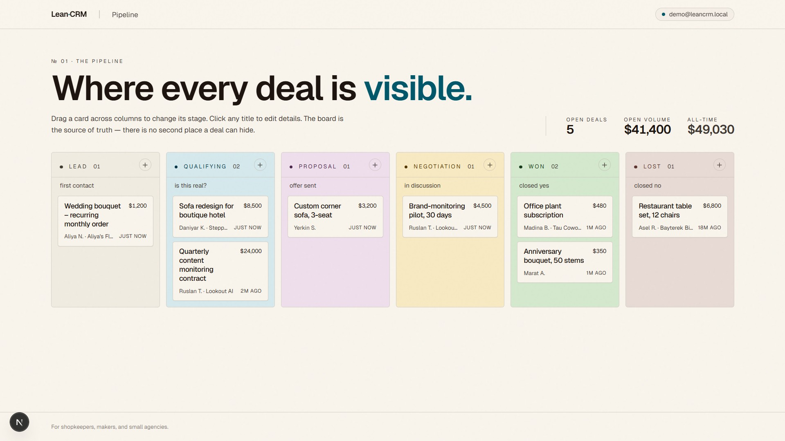
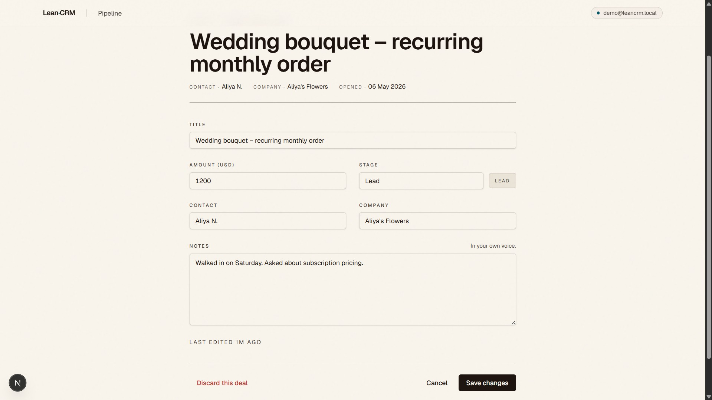
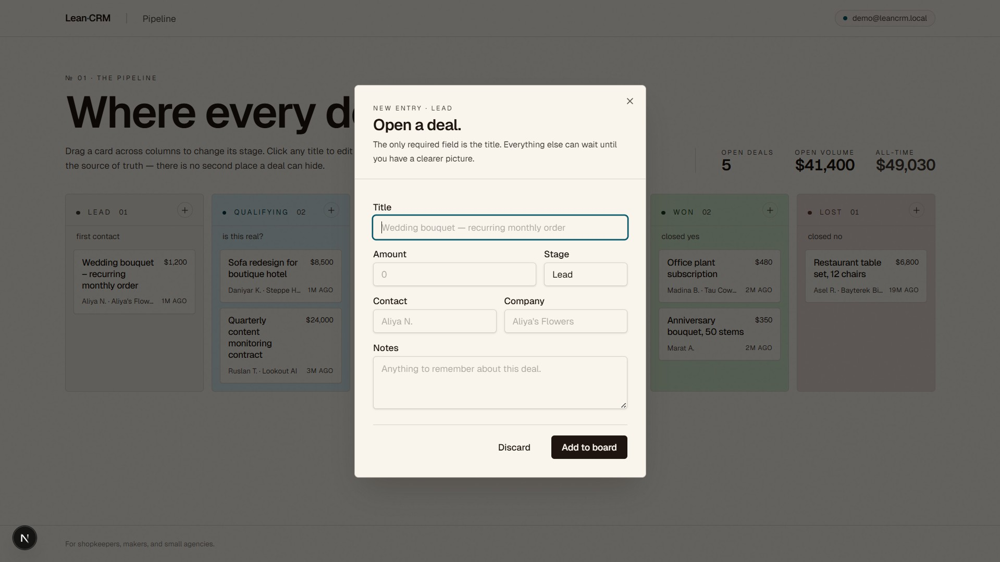
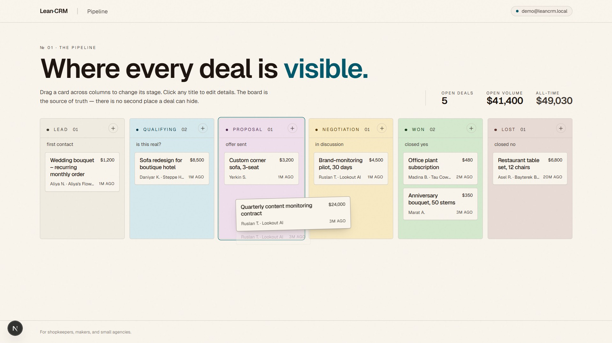
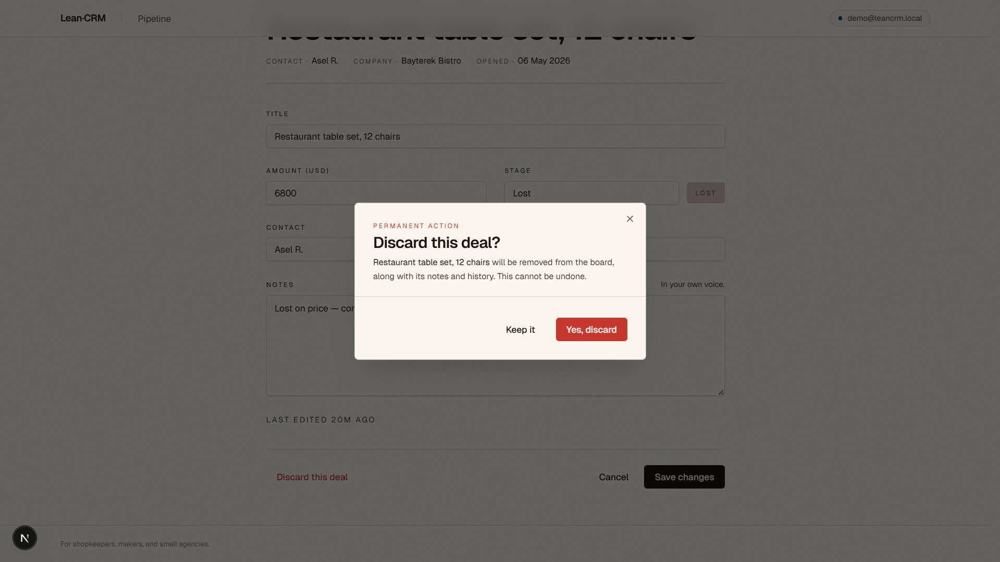

# LeanCRM — Course Project

> **MVP hypothesis (locked):** If we build a single-screen drag-and-drop deal pipeline (LEAD → QUALIFICATION → PROPOSAL → NEGOTIATION → WON / LOST) where a small-team operator can add a deal in under 15 seconds and move it between stages with one drag, we believe operators currently using Excel / Notion / WhatsApp will (a) migrate at least 5 active deals into the board within their first session and (b) return to update deal stages within 72 hours unprompted, because the visual stage-state of every open deal is the artifact they currently lack.

This prototype tests one claim. The claim is that a kanban deal board is the single feature small-team operators are actually missing. Everything else from the LeanCRM scope (auth, contacts, companies, activities, reminders, dashboard, search) is out of scope on purpose.

The same prototype is the deliverable for **Assignment 4** (MVP hypothesis & ethics) and the **Final Project** (delivery report, video, requirements traceability). Both reports live one level up from this directory. For Assignment 4 background see `../Assignment4_Report.md`; for the Final Project deliverables see `../Yaki.pdf` (delivery report) and the YouTube link in §Final delivery below.

Course: Software Development Case Study (CSE-2505M). Team: Meirambek Yaki, Asqar Nurym.

## Live deployment

[leancrm-mw6xpi2qe-illus1ums-projects.vercel.app](https://leancrm-mw6xpi2qe-illus1ums-projects.vercel.app/) — Vercel + Turso (managed libSQL). Sign in with the seeded demo user `demo@leancrm.local` / `demo12345`, or register a fresh account at `/register`.

## Demo

Video walkthrough: [Google Drive](https://drive.google.com/file/d/1LEqR-CSg_X2gGydx6uSJsJw0OygRBBoK/view?usp=sharing)

### 1. Pipeline board

The main screen. Six dyed-paper columns, a deal count per column, and live totals on the right. Each column has a one-line gloss ("first contact", "is this real?") and a `+` button for adding a deal in that stage.



### 2. Deal detail and edit

A letterhead-style detail page. Every field on the deal is editable inline. Save changes runs the same Zod schema that protects the create flow.



### 3. New-deal dialog

One required field, the title. Everything else is optional. The stage defaults to whichever column you clicked the `+` on.



### 4. Drag-and-drop in flight

Dragging a card lifts it with a small rotation and a warm shadow. We call it the "paper-lift" effect. The drop is optimistic. The card moves immediately, and the Server Action persists the change in the background.



### 5. Custom confirm-discard dialog

The destructive action is gated by a paper-style modal. Not the native browser confirm.



## What's inside

Two screens. Real navigation between them. No fake buttons. Drag-and-drop persists to SQLite via Prisma.

The first screen is `/board`, a six-column pipeline. Drag cards between stages with optimistic UI; the move rolls back if the server rejects it. Click any card and you land on its detail page. The "+ Add" button on each column opens a modal that creates a deal in that stage.

The second screen is `/deals/[id]`. It is the deal detail and edit form. Editable fields: title, amount, stage, contact, company, notes. Delete needs confirmation. There is a "Back to board" link in the top-left.

## Stack

Next.js 16.2.4 (App Router), React 19, TypeScript strict. Tailwind CSS v4, plus a few hand-rolled shadcn-style UI primitives in `src/components/ui/`. Prisma 7 against SQLite, via `@prisma/adapter-libsql` (pure JS, no native build). `@dnd-kit/core` does the drag-and-drop. Zod validates every Server Action. There are no API routes, only Server Actions for mutations. Vitest runs the unit tests on the stage logic and the Zod schemas. Nine tests, all passing.

## Tech-debt acknowledged in the report

We made three trade-offs on purpose, and they are all in Part 3.2 of the report.

SQLite instead of Postgres. Assignment 3 ADR-001 specifies Postgres, but the prototype uses file-based SQLite for zero-ops setup. Swapping is one line in `prisma/schema.prisma` plus a connection string change.

No authentication. Assignment 1 and 3 specify Auth.js v5. The prototype hard-codes a seeded `demo@leancrm.local` user via `src/lib/auth.ts::getCurrentUserId()`. Real auth wires into the same Server Actions. We deferred it on purpose so the prototype stays focused on the hypothesis.

Contact and company are free-text fields on the Deal record, not separate entities. Assignment 1 specifies first-class Contact and Company tables with cross-record activities. The prototype keeps them as strings on the Deal so the board feels like a CRM, without dragging in unrelated CRUD work.

## Run it

You need Node 22 or newer (we tested on Node 24) and npm.

```bash
npm install
npx prisma migrate dev      # creates ./dev.db with the User + Deal tables
npm run db:seed             # seeds the demo user + 8 demo deals across 6 stages
npm run dev                 # http://localhost:3000 redirects to /board
```

Other useful scripts:

```bash
npm run build               # production build (TypeScript strict)
npm run test                # vitest run, 9 unit tests
npm run db:reset            # wipe and re-seed
```

## Demo workflow

Run `npm run dev`, then walk through this:

1. The browser opens `/board` with 8 seeded deals spread across 6 columns.
2. Click **+ Add** at the top of any column. A dialog opens. Fill in the title (the only required field). Add amount, contact, company, or notes if you want. Submit. The card lands in the chosen column.
3. Drag a card from one column to another. The card moves immediately (optimistic UI). The Server Action validates the new stage with Zod and persists with `prisma.deal.updateMany({ where: { id, userId } })`. If it fails, the card snaps back and an inline error appears at the top.
4. Click any card title. You land on `/deals/[id]`. Edit any field. Hit **Save changes**. The board reflects the change when you go back.
5. Hit **Delete** on a deal detail page. Confirm. The deal is gone and you are redirected to `/board`.

That is the end-to-end flow under test.

## Privacy by Design

The schema in `prisma/schema.prisma` is where the privacy decisions actually live. Not in a doc somewhere.

Data minimisation. The `User` model has only `id`, `email`, `name`, and `createdAt`. The `Deal` model has only the fields the workflow uses. We deliberately omit phone, photo, login IP, lead source, tags, and social handles.

Purpose limitation. Every Server Action calls `getCurrentUserId()` and passes `where: { userId }` into the Prisma query. There is no helper anywhere that reads a deal without owner scoping.

Default = private. There is no team-sharing field in v1. When sharing arrives, the default for new deals stays private. It will be a per-record toggle, not a global setting.

Right to erasure. The `Deal` relation declares `onDelete: Cascade`. Deleting the User row removes every owned Deal in the same transaction. The production target adds an `ErasureLog` table with `userIdHash`, `deletedAt`, and `recordCounts`, and runs the deletion against the 30-day backup rotation. See report Part 2.1 for the full version.

## Ethical risks

Two risks. Both are CRM-specific. See report Part 2.2 for the full mapping to IEEE EAD principles and Greyball checks.

Surveillance creep via the activity log. The fix: activity is visible only to the actor and to the workspace owner. When an owner views a teammate's activity, the teammate gets a notification. The surveilled employee is never kept in the dark.

Reminder pressure as a coercion surface. The fix: reminders in v1 are self-only. When cross-user reminders eventually land, every reminder displays "created by [name]" prominently. Default quiet hours are 19:00–08:00. Users opt in to off-hours delivery. They never opt out.

## Files of interest

- [src/app/board/page.tsx](src/app/board/page.tsx) — server-side fetch and group by stage
- [src/app/board/board-client.tsx](src/app/board/board-client.tsx) — `@dnd-kit` drag-and-drop with optimistic UI; this file is where the hypothesis lives
- [src/app/board/new-deal-dialog.tsx](src/app/board/new-deal-dialog.tsx) — create-deal modal
- [src/app/deals/[id]/page.tsx](src/app/deals/%5Bid%5D/page.tsx) — deal detail server fetch
- [src/app/deals/[id]/deal-edit-form.tsx](src/app/deals/%5Bid%5D/deal-edit-form.tsx) — edit and delete
- [src/lib/actions/deals.ts](src/lib/actions/deals.ts) — Server Actions, Zod validation, owner scoping
- [src/lib/schemas.ts](src/lib/schemas.ts) — Zod source of truth
- [src/lib/stages.ts](src/lib/stages.ts) — stage order and display
- [prisma/schema.prisma](prisma/schema.prisma) — schema with privacy-by-design comments

## Repo + deployment

- Source: [github.com/illus1um/leancrm](https://github.com/illus1um/leancrm)
- Live: [leancrm-mw6xpi2qe-illus1ums-projects.vercel.app](https://leancrm-mw6xpi2qe-illus1ums-projects.vercel.app/) (Vercel + Turso)

## Final delivery (CSE-2505M)

The Final Project delivery report (`Yaki.pdf`) carries the requirements-traceability table for every FR / NFR from Assignment 1, the MVP hypothesis outcome with quoted user-test evidence, the development process summary (Kanban, commit timeline), the Theory in Practice section citing Anderson's *Kanban: Successful Evolutionary Change for Your Technology Business*, and the architecture delta against the Assignment 3 design. The 8-minute YouTube demo + presentation is linked in the report header.

The commit history at [github.com/illus1um/leancrm/commits/main](https://github.com/illus1um/leancrm/commits/main) shows 14 commits between 2026-04-06 and 2026-05-09 distributed across the four Assignment 2 phases — this is the evidence required by Section 4 of the Final Project rubric.

## License

Course work. No license claim beyond fair academic use.
